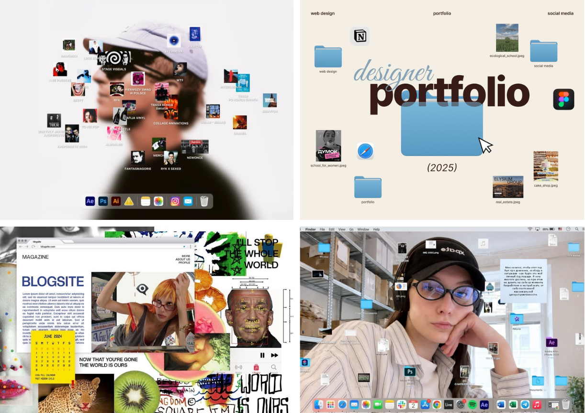
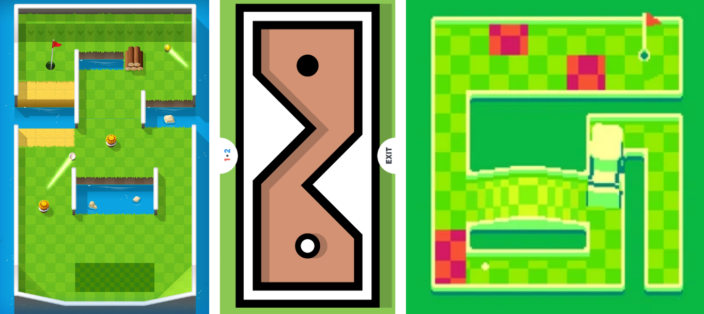

# Portfolio

Before you say anything, this website is still a work in progress. Sorry if it looks kind of scuffed. 

For my portfolio, I wanted to make a fun and interactive website, that users can have fun navigating. 

Therefore, when I started designing the website, I had a few considerations:
- Needs to reflect my personality
- Needs to be fun to play around with
- Needs to still be aesthetic and technically good. 

<!-- chunk -->

I had this initial how might we statement:

### [How might we make navigating the website more fun?](#color-red)

Using this initial problem statement, I had generated a few concepts:
- Platformer game
- Puzzle game
- Mini-desktop concept
- Mini-diorama

I initially wanted to do the "mini-desktop" concept, inspired by other portfolio websites, due to the drag and drop mechanic.

<!-- chunk -->

I enjoyed playing around with the idea of how you could manipulate the different elements on the screen. However, after stepping back and assessing it from a more objective standpoint, I realised the drag and drop desktop concept may be too overwhelming for casual viewers, due to the amount of information presented.

After a while, I decided to combine the mini-diorama and puzzle game concept into a mini-golf concept, as it allowed the user to navigate the website in the same way as a video game map, changing the interaction type from just simple scrolling to exploring. 

Before I started developing the concept, I took a look at existing mini-golf games available. 

<!-- chunk -->

Afterwards, I tried to figure out how I can push the concept further. 

I played around with the idea of having buttons that can be pressed with golf ball hits, and using golf holes to navigate the pages. 

Additionally, on regular webpages, you can press a "back-to-top" button, which takes you to the top of the website. However, to fit the "mini-golf" concept, I realise we can make these buttons similar to water obstacles found in fairways and existing mini-golf games. 

For the implementation, I utilised React, TSX, matter.js for the physics, and also github pages for the deployment. 